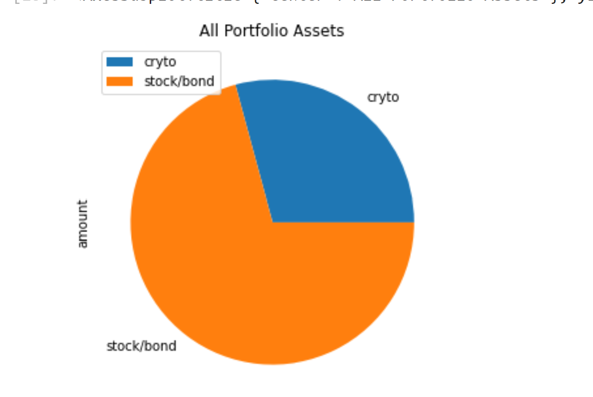
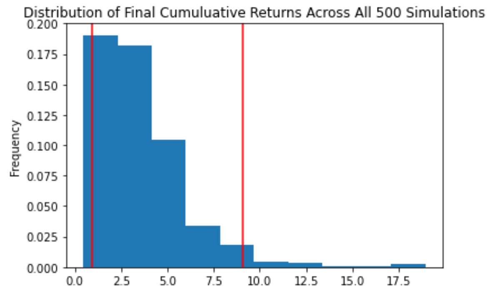
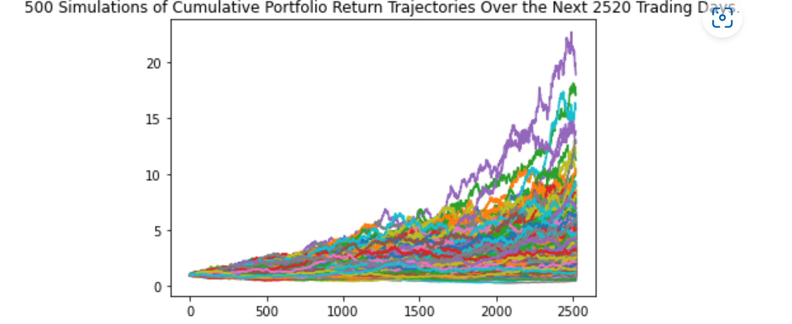
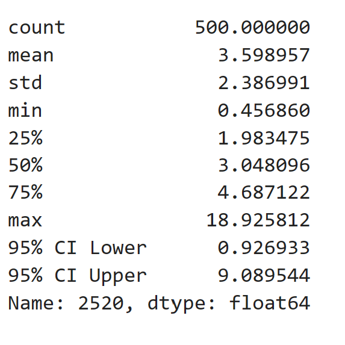

# Financial Planning
### Purpose
This application performs financial planning and analysis based on user provided data.
It calculates if the user will have sufficent funds in case of an emergency and allows for retirement planning based on savings

### Planning functions:
1: Emergency Fund Planning
  The application provides visualizations of the user's savings and calculates if the user will have sufficient funds in case of an emergency

2: Retirement Planning
  A 30 year Montecarlo Simulation is used to forecast the portfolio value based on current price of funds using Alpaca's API.

    MC ForecastTools.py

    Alpaca API
    
---
## Technologies
### Python:

    Phyton Version: **3.7.13**

## Libraries and Dependencies
### Json
[Json](https://matplotlib.org/stable/api/_as_gen/matplotlib.pyplot.plot.html)

### Alpaca
[Alpaca](https://alpaca.markets/docs/api-references/market-data-api/)

### Requests
[Requests](https://realpython.com/python-requests/)

### os
[os](https://docs.python.org/3/library/os.html)

### MCForecastTools
[MCForecastTools](https://pbpython.com/monte-carlo.html)

---
## How it works

1. Clone the repository
2. Alpaca API and individual keys are needed. Save these as .ENV files in the same folder
2. Run the file using Jupiter Notebook

---
## Usage

### Portfolio Value Pie Chart:

### Monte Carlo 10 year plot:

### Monte Carlo 10 year line plot:

### Monte Carlo 10 year cumulative value sum with 95% Lower and Upper Confidence Intevals:

---
## Contributors
Startup code provided by UW FinTech Bootcamp

---
## License
Portfolio Risk Analysis tool is available under an MIT License.

---
## Aknowledgements
* [Markdown Guide](https://www.markdownguide.org/basic-syntax/#reference-style-links)

<!-- MARKDOWN LINKS & IMAGES -->
<!-- https://www.markdownguide.org/basic-syntax/#reference-style-links -->
